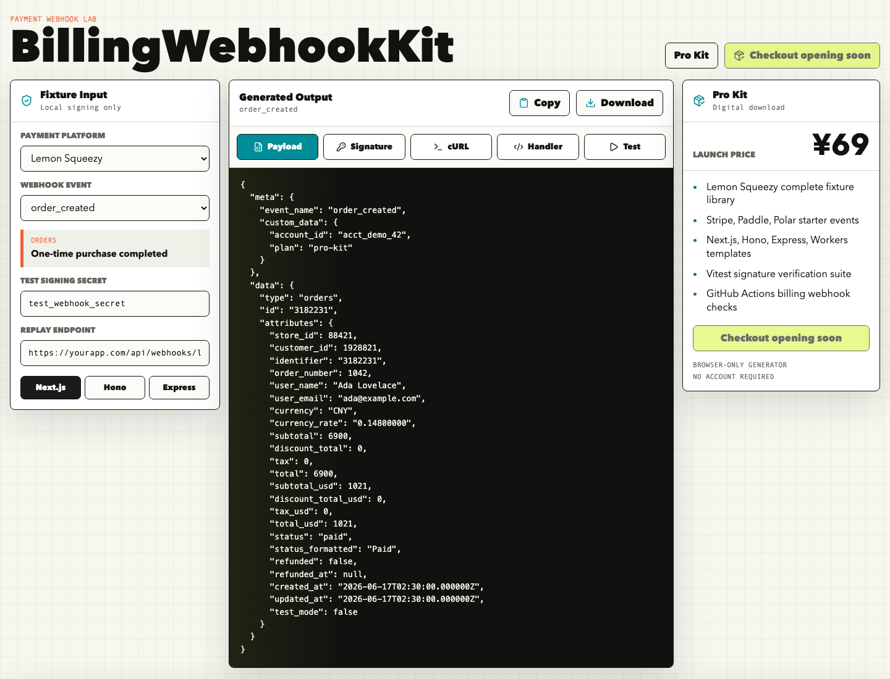

# BillingWebhookKit

[](https://github.com/qihaze123/billing-webhook-kit/actions/workflows/deploy.yml)
[](https://github.com/qihaze123/billing-webhook-kit/actions/workflows/site-health.yml)
[](https://github.com/qihaze123/billing-webhook-kit/releases/tag/v0.1.0)


Browser-only payment webhook fixture generator, raw-body signature verifier, signature mismatch debugger, payload inspector, idempotency key builder, contract test generator, entitlement decision matrix, launch readiness scorecard, duplicate replay simulator, debugging cost calculator, and review report exporter for SaaS billing integrations.

Use it when you need to test a billing webhook route before a real Lemon Squeezy, Stripe, Paddle, or Polar event hits production.

## Fast Paths

- Live tool: https://qihaze123.github.io/billing-webhook-kit/
- Free sample: https://qihaze123.github.io/billing-webhook-kit/free-sample.html
- Free sample GitHub release: https://github.com/qihaze123/billing-webhook-kit/releases/tag/v0.1.0
- Guide index: https://qihaze123.github.io/billing-webhook-kit/guides/
- Tool index: https://qihaze123.github.io/billing-webhook-kit/tools/
- Lemon Squeezy webhook troubleshooting hub: https://qihaze123.github.io/billing-webhook-kit/troubleshooting.html
- Launch evidence pack: https://qihaze123.github.io/billing-webhook-kit/billing-webhook-launch-evidence-pack.html
- Pro sample report: https://qihaze123.github.io/billing-webhook-kit/billing-webhook-kit-pro-sample-report.html
- Checkout smoke test report generator: https://qihaze123.github.io/billing-webhook-kit/tools/lemon-squeezy-checkout-smoke-test-report.html
- Lemon Squeezy PayPal live checkout report: https://qihaze123.github.io/billing-webhook-kit/tools/lemon-squeezy-paypal-live-checkout-report.html
- Lemon Squeezy production checkout readiness report: https://qihaze123.github.io/billing-webhook-kit/tools/lemon-squeezy-production-checkout-readiness-report.html
- Lemon Squeezy fulfillment checklist generator: https://qihaze123.github.io/billing-webhook-kit/tools/lemon-squeezy-fulfillment-checklist-generator.html
- Lemon Squeezy paid order delivery incident report: https://qihaze123.github.io/billing-webhook-kit/tools/lemon-squeezy-paid-order-delivery-incident-report.html
- Lemon Squeezy refund rollback report generator: https://qihaze123.github.io/billing-webhook-kit/tools/lemon-squeezy-refund-rollback-report.html
- Lemon Squeezy delivery email template generator: https://qihaze123.github.io/billing-webhook-kit/tools/lemon-squeezy-delivery-email-template-generator.html
- Lemon Squeezy webhook event coverage matrix: https://qihaze123.github.io/billing-webhook-kit/tools/lemon-squeezy-webhook-event-coverage-matrix.html
- Standalone billing webhook launch readiness scorecard: https://qihaze123.github.io/billing-webhook-kit/tools/billing-webhook-launch-readiness-scorecard.html
- Standalone billing webhook debug cost calculator: https://qihaze123.github.io/billing-webhook-kit/tools/billing-webhook-debug-cost-calculator.html
- Standalone checkout provider decision matrix: https://qihaze123.github.io/billing-webhook-kit/tools/checkout-provider-decision-matrix.html
- Standalone BillingWebhookKit Pro fit checker: https://qihaze123.github.io/billing-webhook-kit/tools/billing-webhook-pro-fit-checker.html
- Standalone Lemon Squeezy payload generator: https://qihaze123.github.io/billing-webhook-kit/tools/lemon-squeezy-webhook-payload-generator.html
- Standalone Lemon Squeezy x-signature verifier: https://qihaze123.github.io/billing-webhook-kit/tools/lemon-squeezy-signature-verifier.html
- Standalone webhook idempotency key generator: https://qihaze123.github.io/billing-webhook-kit/tools/webhook-idempotency-key-generator.html
- Standalone Stripe webhook fixture generator: https://qihaze123.github.io/billing-webhook-kit/tools/stripe-webhook-fixture-generator.html
- Standalone webhook replay cURL generator: https://qihaze123.github.io/billing-webhook-kit/tools/webhook-replay-curl-generator.html
- Standalone Next.js webhook handler generator: https://qihaze123.github.io/billing-webhook-kit/tools/nextjs-webhook-handler-generator.html
- Standalone Next.js Lemon Squeezy raw body audit: https://qihaze123.github.io/billing-webhook-kit/tools/nextjs-lemon-squeezy-raw-body-audit.html
- Standalone Vercel Lemon Squeezy webhook debugger: https://qihaze123.github.io/billing-webhook-kit/tools/vercel-lemon-squeezy-webhook-debugger.html
- Standalone payment webhook test plan generator: https://qihaze123.github.io/billing-webhook-kit/tools/payment-webhook-test-plan-generator.html
- Fix Next.js 405 for Lemon Squeezy webhooks: https://qihaze123.github.io/billing-webhook-kit/guides/nextjs-webhook-405-lemon-squeezy.html
- Fix Lemon Squeezy webhook 500 on Vercel and Next.js: https://qihaze123.github.io/billing-webhook-kit/guides/lemon-squeezy-webhook-500-vercel-nextjs.html
- Lemon Squeezy webhook retry and idempotency guide: https://qihaze123.github.io/billing-webhook-kit/guides/lemon-squeezy-webhook-retry-idempotency.html
- Payment webhook test tool alternatives: https://qihaze123.github.io/billing-webhook-kit/guides/payment-webhook-test-tool-alternatives.html
- Stripe webhook test plan for Next.js: https://qihaze123.github.io/billing-webhook-kit/guides/stripe-webhook-test-plan-nextjs.html
- Stripe webhook order of events in Next.js: https://qihaze123.github.io/billing-webhook-kit/guides/stripe-webhook-order-of-events-nextjs.html
- Paddle webhook signature verification in Next.js: https://qihaze123.github.io/billing-webhook-kit/guides/paddle-webhook-signature-verification-nextjs.html
- Next.js Paddle webhook handler: https://qihaze123.github.io/billing-webhook-kit/guides/nextjs-paddle-webhook-handler.html
- Paddle webhook test plan for Next.js: https://qihaze123.github.io/billing-webhook-kit/guides/paddle-webhook-test-plan-nextjs.html
- Pro Kit preview: https://qihaze123.github.io/billing-webhook-kit/pro-kit.html
- AI SaaS billing webhook checklist: https://qihaze123.github.io/billing-webhook-kit/guides/ai-saas-billing-webhook-checklist.html
- Lemon Squeezy vs Stripe webhooks for AI SaaS: https://qihaze123.github.io/billing-webhook-kit/guides/lemon-squeezy-vs-stripe-webhooks-ai-saas.html
- BillingWebhookKit pricing ROI guide: https://qihaze123.github.io/billing-webhook-kit/guides/billing-webhook-kit-pricing-roi.html
- BillingWebhookKit buyer checklist: https://qihaze123.github.io/billing-webhook-kit/guides/billing-webhook-kit-buyer-checklist.html
- Delivery, refund, and support policy: https://qihaze123.github.io/billing-webhook-kit/delivery-refund-support.html
- Public status: https://qihaze123.github.io/billing-webhook-kit/status.html
- Search Console sitemap submission handoff: https://qihaze123.github.io/billing-webhook-kit/search-console-sitemap-submission.html
- HTML sitemap: https://qihaze123.github.io/billing-webhook-kit/sitemap.html
- Public Pro Kit manifest: https://qihaze123.github.io/billing-webhook-kit/pro-kit-manifest.json

## Launch Checkout Guides

- Lemon Squeezy checkout smoke test: https://qihaze123.github.io/billing-webhook-kit/guides/lemon-squeezy-checkout-smoke-test.html
- Fix Lemon Squeezy checkout 404 from custom price or currency mismatch: https://qihaze123.github.io/billing-webhook-kit/guides/lemon-squeezy-checkout-404-custom-price-currency.html
- Lemon Squeezy PayPal checkout webhook test: https://qihaze123.github.io/billing-webhook-kit/guides/lemon-squeezy-paypal-checkout-webhook-test.html
- Lemon Squeezy production checkout go-live checklist: https://qihaze123.github.io/billing-webhook-kit/guides/lemon-squeezy-production-checkout-go-live.html
- Lemon Squeezy production webhook troubleshooting checklist: https://qihaze123.github.io/billing-webhook-kit/guides/lemon-squeezy-production-webhook-troubleshooting.html
- Fix Next.js 405 for Lemon Squeezy webhooks: https://qihaze123.github.io/billing-webhook-kit/guides/nextjs-webhook-405-lemon-squeezy.html
- Fix Lemon Squeezy webhook 500 on Vercel and Next.js: https://qihaze123.github.io/billing-webhook-kit/guides/lemon-squeezy-webhook-500-vercel-nextjs.html
- Lemon Squeezy webhook retry and idempotency guide: https://qihaze123.github.io/billing-webhook-kit/guides/lemon-squeezy-webhook-retry-idempotency.html
- Payment webhook test tool alternatives: https://qihaze123.github.io/billing-webhook-kit/guides/payment-webhook-test-tool-alternatives.html
- Lemon Squeezy webhook not firing after checkout: https://qihaze123.github.io/billing-webhook-kit/guides/lemon-squeezy-webhook-not-firing-after-checkout.html
- Deliver a digital download after Lemon Squeezy checkout: https://qihaze123.github.io/billing-webhook-kit/guides/lemon-squeezy-digital-download-fulfillment.html
- Lemon Squeezy checkout paid but no download: https://qihaze123.github.io/billing-webhook-kit/guides/lemon-squeezy-checkout-paid-but-no-download.html
- Lemon Squeezy download email not received: https://qihaze123.github.io/billing-webhook-kit/guides/lemon-squeezy-download-email-not-received.html
- Lemon Squeezy refund webhook test: https://qihaze123.github.io/billing-webhook-kit/guides/lemon-squeezy-refund-webhook-test.html
- AI SaaS billing webhook checklist: https://qihaze123.github.io/billing-webhook-kit/guides/ai-saas-billing-webhook-checklist.html
- Lemon Squeezy vs Stripe webhooks for AI SaaS: https://qihaze123.github.io/billing-webhook-kit/guides/lemon-squeezy-vs-stripe-webhooks-ai-saas.html

## Trust Signals

- Browser-only: webhook signing secrets stay local and are processed with Web Crypto.
- No backend: the hosted tool does not upload pasted payloads or secrets.
- Tool index: one scannable entry point with a launch lane for the checkout smoke report, launch readiness scorecard, debug cost calculator, standalone generators, full app, free sample, and Pro Kit preview.
- Standalone checkout smoke report: release-ready evidence for CN¥69 price visibility, checkout URL, paid webhook delivery, duplicate replay, fulfillment, and rollback notes.
- Standalone launch scorecard: production readiness scoring and PR-ready Markdown reports for billing webhook releases.
- Standalone debug cost calculator: estimate avoidable billing webhook debugging cost before hand-assembling fixtures and review notes.
- Standalone Pro fit checker: score checkout stage, provider coverage, setup time, and launch risks before deciding whether the CN¥69 Pro Kit is justified.
- Standalone payload generator: fake Lemon Squeezy webhook fixtures, HMAC signatures, and cURL replay commands.
- Standalone verifier: a focused Lemon Squeezy `x-signature` page for raw-body HMAC checks without account login.
- Standalone idempotency generator: stable retry keys, SQL constraints, handler guards, duplicate replay tests, and review notes for payment webhook side effects.
- Standalone Stripe generator: fake Stripe checkout, invoice, subscription, and payment intent fixtures with local Stripe-Signature headers and cURL replay commands.
- Standalone replay generator: signed cURL replay commands for Lemon Squeezy, Stripe, Paddle, and Polar local webhook route tests.
- Standalone Next.js generator: App Router route handlers with raw-body signature checks, idempotency guard notes, env checklists, and duplicate replay tests.
- Standalone Vercel debugger: browser-only report builder for Lemon Squeezy webhook 404, 405, 500, missing order_created delivery, invalid x-signature, env vars, idempotency, and launch evidence on Vercel.
- Free sample release: public zip with fixture, handler, signature, contract, replay tests, review report, and CI skeleton.
- Pro Kit manifest: public file count, test count, checksum, and safety flags without exposing the paid archive.
- Public status page: checkout readiness, package checksum, free sample digest, sitemap target, and health workflow links in one place.
- Search Console sitemap handoff: exact URL-prefix property, sitemap path, live crawl files, and owner-only submission boundary for Google Search Console.
- HTML sitemap: a crawlable page linking the buyer path, standalone tools, and guide pages from one public URL.
- Troubleshooting hub: a crawlable router from common Lemon Squeezy failures to the right tool or guide, including Vercel 404, Next.js 405, invalid x-signature, checkout 404, and webhook-not-firing cases.
- Pricing ROI guide: buyer decision page for comparing the free tools, the CN¥69 Pro Kit, manual setup time, duplicate replay tests, launch evidence, and break-even math.
- Buyer checklist: pre-purchase page for checking free tools, sample files, manifest, launch evidence, delivery policy, refund boundaries, and when Pro is worth buying.
- Pro sample report: public example of the PR-ready webhook review evidence the paid pack is designed to produce, including signature, duplicate replay, entitlement, CI, and launch notes.
- Launch evidence pack: purchase-adjacent checklist tying checkout smoke, event coverage, fulfillment proof, refund rollback, delivery emails, the free sample, and Pro Kit preview together before a public billing launch.
- PayPal live checkout report: browser-only launch evidence report for PayPal visibility, CN¥69 price, paid webhook delivery, x-signature verification, duplicate replay, private delivery, refund rollback, support evidence, and owner approval.
- Production checkout readiness report: browser-only go-live report for live key setup, CN¥69 price, PayPal checkout, signed webhooks, duplicate replay, private delivery, refund rollback, support path, and release evidence.
- Production checkout go-live guide: when a private Lemon Squeezy checkout can become a public buy link, covering live config, CN¥69 price, PayPal, paid webhooks, duplicate replay, delivery, refund rollback, and support evidence.
- Production webhook troubleshooting guide: debug live checkout webhook delivery, paid order_created events, x-signature verification, duplicate replay, private fulfillment, refund rollback, and launch evidence.
- Delivery and support page: private ZIP delivery flow, checksum verification, support scope, refund triggers, and safe issue-reporting policy.
- Digital delivery guide: fulfillment checklist for private ZIP delivery, signed webhooks, paid-state checks, idempotency, checksum evidence, and duplicate replay safety.
- Paid checkout no-download guide: launch-blocking delivery incident runbook for paid state, order_created delivery, variant mapping, fulfillment logs, private resend, and refund boundaries.
- Paid order incident report: browser-only Markdown report generator for paid checkout, order_created delivery, variant mapping, fulfillment status, private resend, checksum evidence, and refund boundaries.
- Download email support guide: buyer-safe resend runbook for missing Lemon Squeezy download emails, paid-order checks, checksum evidence, duplicate purchases, and refund boundaries.
- Refund webhook guide: signed refund event verification, entitlement rollback, duplicate replay safety, buyer support evidence, and secret-free refund reports.
- Fulfillment checklist generator: browser-only release report for paid order events, private ZIP or license delivery, idempotency, checksum evidence, support policy, and rollback notes.
- Refund rollback report generator: browser-only Markdown evidence for signed refund webhooks, entitlement revocation, duplicate replay safety, support notes, and secret-free release review.
- Delivery email template generator: browser-only buyer delivery, resend, and support email drafts for private ZIP links, checksum evidence, refund policy links, and safe issue reporting.
- Webhook event coverage matrix: browser-only event subscription and test matrix for order_created, subscriptions, license keys, paid-state gates, x-signature verification, idempotency, and duplicate replay.
- Artifact integrity: CI checks that the public sample ZIP hash matches release notes and the private Pro Kit ZIP is not published.
- Site health: GitHub Actions checks live pages, sitemap, Pro Kit signals, free-sample upgrade links, and checkout safety after deployments.
- Production checkout: intentionally disabled until the live Lemon Squeezy key and variant are ready.
- Support policy: use fake fixtures and fake secrets in public issues; see [SUPPORT.md](SUPPORT.md).

## Checklist

Use the public Lemon Squeezy webhook test checklist for signature, contract, idempotency, and duplicate replay review:

https://gist.github.com/qihaze123/3a13c5533c0e4fe69a3b0759668e9789

Use the Next.js raw-body checklist when `x-signature` verification fails after parsing request JSON:

https://gist.github.com/qihaze123/2454b3cf56333186eb3f6de89cc51927

Use the Lemon Squeezy event coverage checklist when deciding which events to subscribe to before live checkout:

https://gist.github.com/qihaze123/e84d325435f7d70a03a38542cadd601e

Use the Lemon Squeezy production checkout go-live checklist before turning a private production checkout into a public buy link:

https://gist.github.com/qihaze123/030e189b70aca77bd37bdc271012c38d

Use the Vercel Lemon Squeezy webhook debugger checklist when a Next.js production route returns 404, 405, 500, missing delivery, or invalid `x-signature` after deploy:

https://gist.github.com/qihaze123/9c7b6379513f6b66161451cb0cea1166

Use the Next.js webhook 405 guide when the deployed Lemon Squeezy endpoint exists but rejects POST with Method Not Allowed:

https://qihaze123.github.io/billing-webhook-kit/guides/nextjs-webhook-405-lemon-squeezy.html

Use the Lemon Squeezy webhook 500 guide when the deployed Vercel or Next.js route crashes after Lemon Squeezy reaches it:

https://qihaze123.github.io/billing-webhook-kit/guides/lemon-squeezy-webhook-500-vercel-nextjs.html

Use the Lemon Squeezy webhook retry and idempotency guide when duplicate deliveries could repeat downloads, licenses, emails, or access grants:

https://qihaze123.github.io/billing-webhook-kit/guides/lemon-squeezy-webhook-retry-idempotency.html

Use the payment webhook test plan generator when you need a PR-ready coverage plan across signatures, idempotency, replay, entitlement, fulfillment, refunds, and CI:

https://qihaze123.github.io/billing-webhook-kit/tools/payment-webhook-test-plan-generator.html

Use the Stripe webhook test plan for Next.js guide when a Stripe checkout route needs raw-body signature evidence, fixture coverage, idempotency, duplicate replay, and CI gates before launch:

https://qihaze123.github.io/billing-webhook-kit/guides/stripe-webhook-test-plan-nextjs.html

Use the Paddle webhook test plan for Next.js guide when a Paddle checkout route needs Paddle-Signature raw-body evidence, transaction.completed fixtures, subscription lifecycle checks, idempotency, duplicate replay, and CI gates before launch:

https://qihaze123.github.io/billing-webhook-kit/guides/paddle-webhook-test-plan-nextjs.html

Use the Paddle webhook signature verification in Next.js guide when a Paddle route needs exact raw-body verification, Paddle-Signature fixture checks, and duplicate replay safety before launch:

https://qihaze123.github.io/billing-webhook-kit/guides/paddle-webhook-signature-verification-nextjs.html

Use the Next.js Paddle webhook handler guide when a Paddle route needs request.text(), event mapping, idempotency, duplicate replay tests, and CI gates before checkout traffic:

https://qihaze123.github.io/billing-webhook-kit/guides/nextjs-paddle-webhook-handler.html

Use the payment webhook test tool alternatives guide when comparing webhook inboxes, provider CLIs, browser-only fixtures, CI tests, and the CN¥69 Pro Kit:

https://qihaze123.github.io/billing-webhook-kit/guides/payment-webhook-test-tool-alternatives.html



The free tool generates Lemon Squeezy webhook payloads, verifies HMAC signatures against exact raw request bodies, debugs signature mismatches, inspects trusted billing fields, builds idempotency keys, generates contract tests, recommends idempotency keys, maps events to entitlement decisions, scores launch readiness, simulates duplicate webhook replays, estimates webhook debugging cost, exports PR-ready Markdown review reports, creates cURL replay commands, and provides starter handlers for Next.js, Hono, and Express. It is designed for local billing integration tests, CI fixtures, and webhook replay debugging.

## What It Helps Test

- Lemon Squeezy `order_created` and subscription events
- HMAC SHA-256 webhook signature verification
- Received `x-signature` headers against exact raw request bodies
- Signature mismatch diagnosis for raw-body changes, wrong secrets, header formats, framework parsers, and cURL replay mistakes
- Payload inspection for event name, object ID, customer, status, amount, and target record
- Idempotency key generation from provider, uniqueness scope, event name, and object ID
- Contract test generation for stable event, object, status, customer, currency, and idempotency fields
- Recommended idempotency keys for safe webhook retries
- Entitlement decisions for access grants, license delivery, renewals, cancellations, failed payments, and unknown events
- Launch readiness scoring for signature tests, duplicate replay, entitlement policy, fixtures, secrets, smoke tests, review reports, and monitoring
- AI-generated and vibe-coded SaaS billing route checks before a Lemon Squeezy, Stripe, Paddle, or Polar checkout link goes public
- Lemon Squeezy and Stripe webhook launch-plan comparison for AI SaaS teams choosing a checkout provider
- Checkout provider decision matrices for AI SaaS teams comparing Lemon Squeezy, Stripe, Paddle, and Polar launch risks
- BillingWebhookKit Pro fit reports for deciding whether free tools are enough, launch evidence is missing, or CN¥69 is a reasonable shortcut
- Digital download fulfillment after Lemon Squeezy checkout with private ZIP delivery, paid-state checks, idempotency, checksum evidence, and support-policy links
- PR-ready fulfillment checklist reports for signed paid events, private delivery, duplicate replay safety, buyer evidence, and rollback notes
- Replay-safe fulfillment checks for paid-state verification, delivery locks, checksum evidence, duplicate webhook delivery, and refund rollback
- PR-ready production checkout readiness reports for live key setup, CN¥69 price, PayPal checkout, paid webhooks, duplicate replay, private delivery, refund rollback, and release evidence
- PR-ready PayPal live checkout reports for CN¥69 price visibility, PayPal checkout, paid webhook delivery, x-signature verification, duplicate replay, private delivery, refund rollback, support evidence, and owner approval
- Vercel and Next.js Lemon Squeezy webhook launch debugging for 404, 405, 500, missing delivery, invalid x-signature, raw-body regressions, env vars, idempotency, and weak release evidence
- PR-ready refund rollback reports for signed refund events, entitlement revocation, duplicate replay safety, support evidence, and secret-free release review
- Buyer delivery, resend, and support email templates for Lemon Squeezy paid digital products
- Lemon Squeezy webhook event coverage planning for order, subscription, license, payment, paid-state, signature, idempotency, and duplicate replay checks
- Lemon Squeezy refund webhook rollback checks for access revocation, support evidence, duplicate replay safety, and secret-free reports
- Lemon Squeezy production checkout go-live checks for live config, CN¥69 price, PayPal checkout, paid webhooks, duplicate replay, private delivery, refund rollback, and release evidence
- Stripe webhook event-order checks for checkout.session.completed, invoice.paid, subscription lifecycle events, out-of-order delivery, duplicate replay, and entitlement reconciliation
- Duplicate replay behavior for process-once/skip-duplicate tests
- Webhook debugging cost estimates for launch planning
- PR-ready Markdown reports for webhook route review and release checklists
- cURL webhook replay into local, tunnel, staging, or CI routes
- Next.js, Hono, and Express raw-body handler patterns
- Billing webhook idempotency and retry behavior

## Pro Kit

The paid Pro Kit launch price is CN¥69 and adds copy-ready billing webhook assets:

- Lemon Squeezy fixture library
- Stripe, Paddle, and Polar starter fixtures
- Next.js, Hono, Express, and Cloudflare Workers route templates
- Vitest signature verification, contract, and duplicate replay tests
- GitHub Actions billing webhook CI checks
- Webhook review report templates and release checklist notes
- Idempotency runbook, integration checklist, and replay notes

Use the free sample to validate the format first. It includes one Lemon Squeezy fixture, one Next.js handler, signature/contract/duplicate-replay tests, a review report sample, and a CI skeleton. Upgrade when you need the full 29-file package, more Lemon Squeezy lifecycle fixtures, Stripe/Paddle/Polar starter events, four route handlers, and 12 verified local tests.

Preview page: https://qihaze123.github.io/billing-webhook-kit/pro-kit.html

Launch evidence pack: https://qihaze123.github.io/billing-webhook-kit/billing-webhook-launch-evidence-pack.html

Pro sample report: https://qihaze123.github.io/billing-webhook-kit/billing-webhook-kit-pro-sample-report.html

Production checkout readiness report: https://qihaze123.github.io/billing-webhook-kit/tools/lemon-squeezy-production-checkout-readiness-report.html

PayPal live checkout report: https://qihaze123.github.io/billing-webhook-kit/tools/lemon-squeezy-paypal-live-checkout-report.html

Pro fit checker: https://qihaze123.github.io/billing-webhook-kit/tools/billing-webhook-pro-fit-checker.html

Free sample pack: https://qihaze123.github.io/billing-webhook-kit/free-sample.html

Free sample GitHub release: https://github.com/qihaze123/billing-webhook-kit/releases/tag/v0.1.0

Public Pro Kit manifest: https://qihaze123.github.io/billing-webhook-kit/pro-kit-manifest.json

Delivery, refund, and support policy: https://qihaze123.github.io/billing-webhook-kit/delivery-refund-support.html

Public checkout and package status: https://qihaze123.github.io/billing-webhook-kit/status.html

Search Console sitemap handoff: https://qihaze123.github.io/billing-webhook-kit/search-console-sitemap-submission.html

HTML sitemap: https://qihaze123.github.io/billing-webhook-kit/sitemap.html

Buyer checklist: https://qihaze123.github.io/billing-webhook-kit/guides/billing-webhook-kit-buyer-checklist.html

Current checkout state: public checkout is disabled until live Lemon Squeezy production configuration is connected. The Pro Kit archive stays private; the manifest exposes file count, test count, checksum, and safety flags for pre-purchase inspection. The buyer policy page explains delivery, checksum verification, support scope, refund triggers, and safe issue reporting before the buy link is published.

## Guides

- https://qihaze123.github.io/billing-webhook-kit/guides/
- https://qihaze123.github.io/billing-webhook-kit/tools/
- https://qihaze123.github.io/billing-webhook-kit/billing-webhook-launch-evidence-pack.html
- https://qihaze123.github.io/billing-webhook-kit/billing-webhook-kit-pro-sample-report.html
- https://qihaze123.github.io/billing-webhook-kit/tools/lemon-squeezy-paypal-live-checkout-report.html
- https://qihaze123.github.io/billing-webhook-kit/tools/lemon-squeezy-production-checkout-readiness-report.html
- https://qihaze123.github.io/billing-webhook-kit/tools/lemon-squeezy-webhook-payload-generator.html
- https://qihaze123.github.io/billing-webhook-kit/tools/lemon-squeezy-signature-verifier.html
- https://qihaze123.github.io/billing-webhook-kit/tools/webhook-idempotency-key-generator.html
- https://qihaze123.github.io/billing-webhook-kit/tools/stripe-webhook-fixture-generator.html
- https://qihaze123.github.io/billing-webhook-kit/tools/webhook-replay-curl-generator.html
- https://qihaze123.github.io/billing-webhook-kit/tools/nextjs-webhook-handler-generator.html
- https://qihaze123.github.io/billing-webhook-kit/tools/nextjs-lemon-squeezy-raw-body-audit.html
- https://qihaze123.github.io/billing-webhook-kit/tools/vercel-lemon-squeezy-webhook-debugger.html
- https://qihaze123.github.io/billing-webhook-kit/tools/billing-webhook-launch-readiness-scorecard.html
- https://qihaze123.github.io/billing-webhook-kit/tools/billing-webhook-pro-fit-checker.html
- https://qihaze123.github.io/billing-webhook-kit/tools/lemon-squeezy-fulfillment-checklist-generator.html
- https://qihaze123.github.io/billing-webhook-kit/tools/lemon-squeezy-paid-order-delivery-incident-report.html
- https://qihaze123.github.io/billing-webhook-kit/tools/lemon-squeezy-refund-rollback-report.html
- https://qihaze123.github.io/billing-webhook-kit/tools/lemon-squeezy-delivery-email-template-generator.html
- https://qihaze123.github.io/billing-webhook-kit/tools/lemon-squeezy-webhook-event-coverage-matrix.html
- https://qihaze123.github.io/billing-webhook-kit/guides/lemon-squeezy-webhook-not-firing-after-checkout.html
- https://qihaze123.github.io/billing-webhook-kit/guides/lemon-squeezy-digital-download-fulfillment.html
- https://qihaze123.github.io/billing-webhook-kit/guides/lemon-squeezy-checkout-paid-but-no-download.html
- https://qihaze123.github.io/billing-webhook-kit/guides/lemon-squeezy-download-email-not-received.html
- https://qihaze123.github.io/billing-webhook-kit/guides/lemon-squeezy-refund-webhook-test.html
- https://qihaze123.github.io/billing-webhook-kit/guides/nextjs-payment-webhook-refund-rollback-test.html
- https://qihaze123.github.io/billing-webhook-kit/guides/lemon-squeezy-webhook-test.html
- https://qihaze123.github.io/billing-webhook-kit/guides/lemon-squeezy-webhook-signature.html
- https://qihaze123.github.io/billing-webhook-kit/guides/lemon-squeezy-webhook-test-checklist.html
- https://qihaze123.github.io/billing-webhook-kit/guides/lemon-squeezy-webhook-raw-body-nextjs.html
- https://qihaze123.github.io/billing-webhook-kit/guides/lemon-squeezy-x-signature-invalid.html
- https://qihaze123.github.io/billing-webhook-kit/guides/lemon-squeezy-order-created-fixture.html
- https://qihaze123.github.io/billing-webhook-kit/guides/lemon-squeezy-checkout-smoke-test.html
- https://qihaze123.github.io/billing-webhook-kit/guides/lemon-squeezy-checkout-404-custom-price-currency.html
- https://qihaze123.github.io/billing-webhook-kit/guides/lemon-squeezy-paypal-checkout-webhook-test.html
- https://qihaze123.github.io/billing-webhook-kit/guides/lemon-squeezy-production-checkout-go-live.html
- https://qihaze123.github.io/billing-webhook-kit/guides/webhook-signature-mismatch-debugger.html
- https://qihaze123.github.io/billing-webhook-kit/guides/lemon-squeezy-webhook-idempotency.html
- https://qihaze123.github.io/billing-webhook-kit/guides/webhook-idempotency-key-generator.html
- https://qihaze123.github.io/billing-webhook-kit/guides/payment-webhook-contract-test-generator.html
- https://qihaze123.github.io/billing-webhook-kit/guides/payment-webhook-ci-tests.html
- https://qihaze123.github.io/billing-webhook-kit/guides/payment-webhook-audit-log-nextjs.html
- https://qihaze123.github.io/billing-webhook-kit/guides/payment-webhook-dead-letter-queue-nextjs.html
- https://qihaze123.github.io/billing-webhook-kit/guides/payment-webhook-replay-safe-fulfillment-nextjs.html
- https://qihaze123.github.io/billing-webhook-kit/guides/billing-webhook-launch-readiness-checklist.html
- https://qihaze123.github.io/billing-webhook-kit/guides/billing-webhook-cost-calculator.html
- https://qihaze123.github.io/billing-webhook-kit/guides/webhook-entitlement-decision-matrix.html
- https://qihaze123.github.io/billing-webhook-kit/guides/webhook-idempotency-checklist.html
- https://qihaze123.github.io/billing-webhook-kit/guides/webhook-duplicate-replay-test.html
- https://qihaze123.github.io/billing-webhook-kit/guides/webhook-review-checklist.html
- https://qihaze123.github.io/billing-webhook-kit/guides/saas-billing-webhook-test-plan.html
- https://qihaze123.github.io/billing-webhook-kit/guides/lemon-squeezy-webhook-fixtures.html
- https://qihaze123.github.io/billing-webhook-kit/guides/payment-webhook-test-generator.html
- https://qihaze123.github.io/billing-webhook-kit/guides/stripe-webhook-test-plan-nextjs.html
- https://qihaze123.github.io/billing-webhook-kit/guides/stripe-refund-webhook-rollback-nextjs.html
- https://qihaze123.github.io/billing-webhook-kit/guides/stripe-subscription-cancellation-webhook-nextjs.html
- https://qihaze123.github.io/billing-webhook-kit/guides/stripe-invoice-paid-webhook-nextjs.html
- https://qihaze123.github.io/billing-webhook-kit/guides/stripe-invoice-payment-failed-webhook-nextjs.html
- https://qihaze123.github.io/billing-webhook-kit/guides/stripe-webhook-order-of-events-nextjs.html
- https://qihaze123.github.io/billing-webhook-kit/guides/paddle-webhook-signature-verification-nextjs.html
- https://qihaze123.github.io/billing-webhook-kit/guides/nextjs-paddle-webhook-handler.html
- https://qihaze123.github.io/billing-webhook-kit/guides/paddle-webhook-test-plan-nextjs.html
- https://qihaze123.github.io/billing-webhook-kit/guides/nextjs-payment-webhook-entitlement-test-matrix.html
- https://qihaze123.github.io/billing-webhook-kit/guides/billing-webhook-starter-kit.html
- https://qihaze123.github.io/billing-webhook-kit/guides/nextjs-billing-webhook-test-suite.html
- https://qihaze123.github.io/billing-webhook-kit/guides/saas-webhook-release-checklist.html

## Development

```bash
npm install
npm run dev
```

## Build

```bash
npm run build
```

For GitHub Pages, the workflow sets `GITHUB_PAGES=true` so Vite uses the `/billing-webhook-kit/` base path.

## Privacy

Webhook signing secrets are used only in the browser through Web Crypto. The app has no backend and does not upload user input.

## License

The public repository code and documentation are MIT licensed. Private paid Pro Kit archive contents are not published in this repository.
